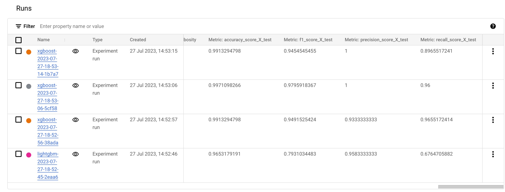

# Tracking ML training experiments with Vertex Experiments

This is an adaptation from this [Google Cloud official tutorial](https://github.com/GoogleCloudPlatform/vertex-ai-samples/blob/main/notebooks/official/experiments/get_started_with_vertex_experiments_autologging.ipynb). I adapted the models trained to make this tutorial more realistic and useful for customers with no deep learning experience. The original tutorial trains three models: a scikit-learn one, a Tensorflow one, and a PyTorch one, and logs the results of the training experiments. This adapted tutorial uses the Vertex AI Python SDK to create a new experiment, train five simple models (one scikit-learn, one LGBM, and three XGBoost models with different hyperparameters), and automatically log the results to be later reviewed in Vertex AI Experiments UI.

